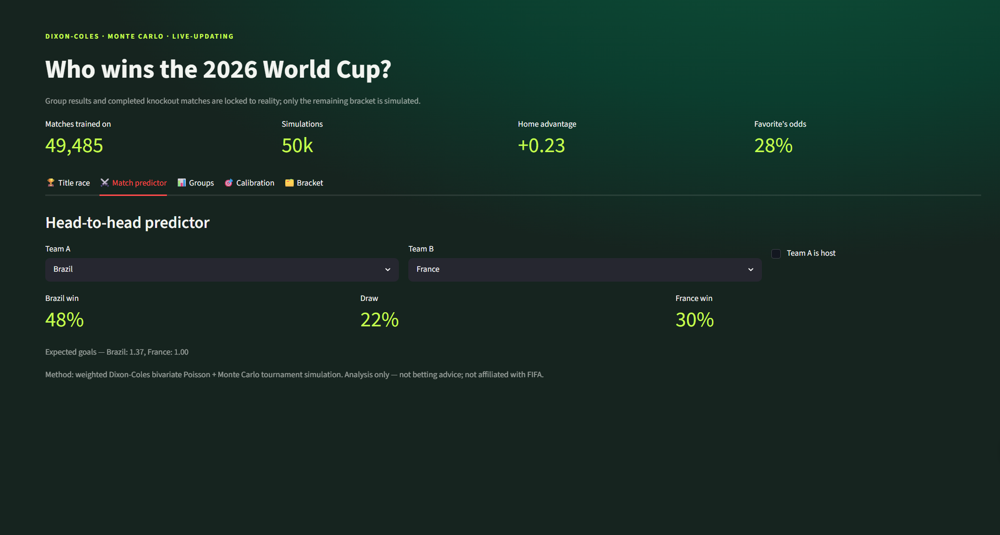
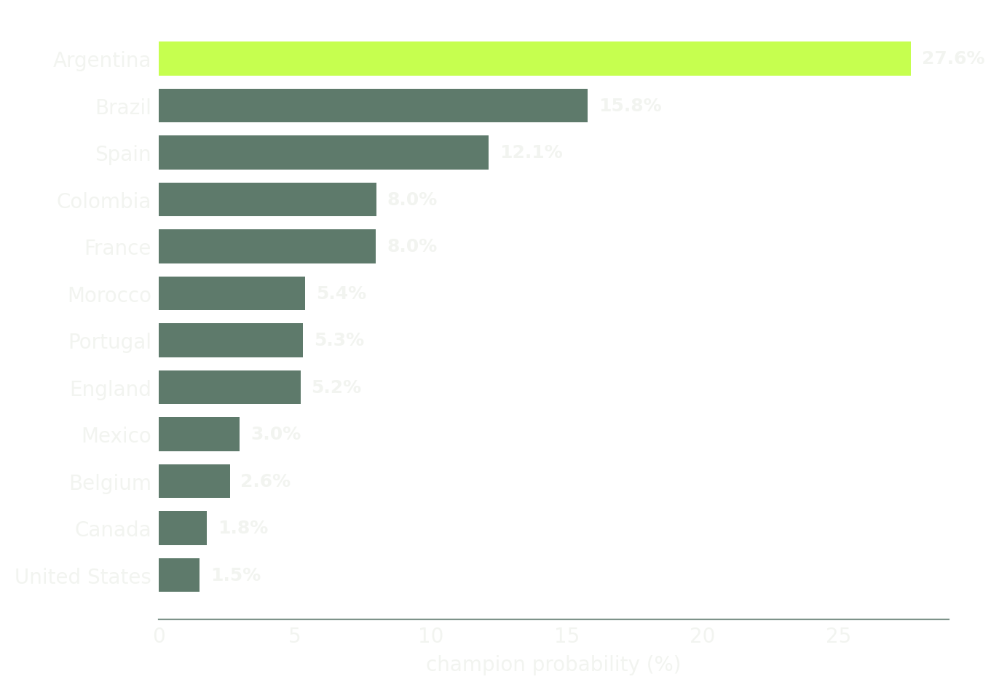

# Who Wins the 2026 World Cup?
### A Live, Calibrated Forecast using Bivariate-Poisson Simulation

**[🔗 Live Demo](https://world-cup-2026-live-forecastergit-d5gyjvqnobu5qfi2xliuja.streamlit.app/)** | **[📂 GitHub Repo](https://github.com/abenezer4/World-cup-2026-live-forecaster.git)**

---

## Dashboard Preview

This is an interactive live forecaster. Explore championship odds, head-to-head match predictions, group standings, and the full tournament bracket:


*Head-to-head match predictor with live probabilities*


*Updated championship odds as the tournament progresses*


*Full bracket view with confidence levels and simulated outcomes*

---

This project is a tournament simulator. It uses a **Dixon–Coles match engine** feeding a **Monte Carlo simulator** to re-price title chances in real-time as the 2026 World Cup unfolds.


## Why Dixon-Coles? (The Methodology)

When predicting a tournament, most developers reach for a standard Classifier (like XGBoost) or a simple Elo rating. This project chooses the **Dixon-Coles Bivariate Poisson model** for its granular simulation capabilities:

*   **Beyond the "Win/Loss" Binary:** Standard classifiers treat a 1–0 win and a 5–0 win as the same "label." In a World Cup, goal difference matters for tie-breakers. Modeling the *rate of goals* allows us to simulate group-stage standings accurately.
*   **Latent Strength Estimation:** The model decomposes every team into **Attack** and **Defense** parameters. This allows us to simulate a match between any two teams by comparing their relative strengths against the "global average."
*   **The "Low-Score Draw" Correction:** It includes a correction parameter ($\rho$) to account for the statistical under-representation of 0–0 and 1–1 draws in standard Poisson models—essential for high-stakes knockout football.

### The "Elo" Reality Check (Honest Limitation)
It is important to note that the Dixon-Coles model **does not clearly beat a well-tuned Elo baseline** on log loss or Brier score in backtesting (see `assets/calibration.png`). 

The "World Football Elo" is a decades-refined, incredibly robust baseline. The advantage of Dixon-Coles isn't a guaranteed predictive edge over Elo—it’s the fact that it **outputs a full scoreline distribution**. While Elo tells you who is more likely to win, Dixon-Coles allows us to simulate the exact goal-based mechanics of a tournament bracket.

---

##  Run It (Out of the Box)

Unlike many data science repos, **real data is included**. 
*   Historical results (`results.csv`)
*   Elo ratings (`elo.csv`)
*   Live 2026 results so far (`wc2026_live.csv`) 

Everything is ready for immediate execution.

### 1. Setup
```bash
git clone https://github.com/abenezer4/World-cup-2026-live-forecaster.git
cd wc2026-forecast
pip install -r requirements.txt
```

### 2. Run the Pipeline
This will prepare the data, fit the model, and run the Monte Carlo simulations:
```bash
python src/run.py
```

### 3. Launch Dashboard
```bash
streamlit run app.py
```

---

## Project Structure

```
wc2026/
├── app.py                          # Main Streamlit application
├── README.md                       # This file
├── requirements.txt                # Python dependencies
├── .gitignore                      # Git ignore rules
│
├── assets/                         # Static assets (charts, images)
│
├── data/                           # (Gitignored) All data files
│   ├── processed/                  # Cleaned & processed data
│   │   ├── champion_probs.csv
│   │   ├── elo.csv
│   │   ├── features.csv
│   │   └── matches.csv
│   ├── raw/                        # Raw input data
│   │   ├── elo.csv
│   │   ├── results.csv
│   │   ├── shootouts.csv
│   │   └── wc2026_live.csv
│   └── team_aliases.csv
│
├── notebook/                       # Jupyter notebooks for exploration
│   └── wc2026_full_workflow.ipynb
│
├── runs/                           # (Gitignored) Simulation run outputs
│   └── {timestamp}/
│       ├── champion_probs.csv
│       └── run_metadata.json
│
└── src/                            # Core pipeline modules
    ├── __init__.py
    ├── app.py                      # Streamlit app entry point
    ├── backtest.py                 # Backtesting utilities
    ├── bracket_view.py             # Tournament bracket visualization
    ├── compute_elo.py              # Elo rating calculations
    ├── config.py                   # Configuration & constants
    ├── features.py                 # Feature engineering
    ├── ingest.py                   # Data ingestion & cleaning
    ├── make_sample_data.py         # Sample data generation
    ├── model.py                    # Dixon-Coles model implementation
    ├── prepare.py                  # Data preparation pipeline
    ├── run.py                      # Main pipeline orchestrator
    └── simulate.py                 # Monte Carlo simulation engine
```

---

## Architecture

| Component | Logic | Purpose |
| :--- | :--- | :--- |
| **Ingest** | `src/ingest.py` | Data cleaning and canonical team-name mapping. |
| **Features** | `src/features.py` | Calculates Elo-at-date, time-decayed weights (180-day half-life), and game importance. |
| **Model** | `src/model.py` | Weighted MLE Dixon-Coles with L2 shrinkage (Regularization). |
| **Sim** | `src/simulate.py` | Vectorized Monte Carlo over the knockout bracket. |
| **App** | `app.py` | Streamlit UI for "What-if" scenarios and live updates. |

---

## Updating for Live Results
As the 2026 World Cup progresses:
1.  Open `data/raw/wc2026_live.csv`.
2.  Add the latest match scores.
3.  Re-run `python src/run.py`.
4.  The dashboard will update with new title probabilities based on the "locked-in" results and simulated remaining bracket.

---

## Limitations
*   **Small Samples:** Teams with very few matches are regularized toward the mean to prevent noise-driven "dark horse" predictions.
*   **Intangibles:** Does not model injuries, red cards, or squad announcements.
*   **Disclaimer:** This is an analytical project for portfolio purposes. It is **not betting advice** and is not affiliated with FIFA.

---
*Built with Python, NumPy, SciPy, and Streamlit.*